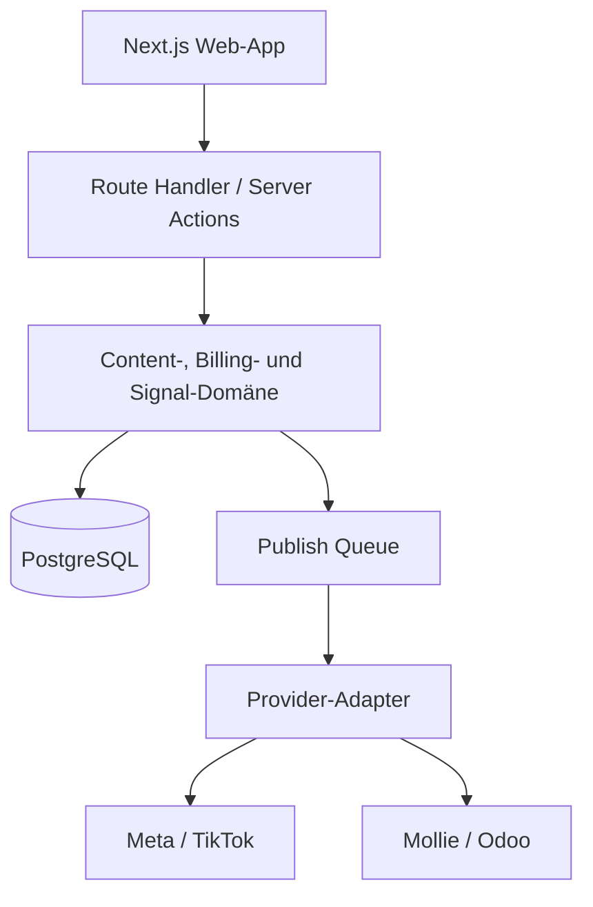
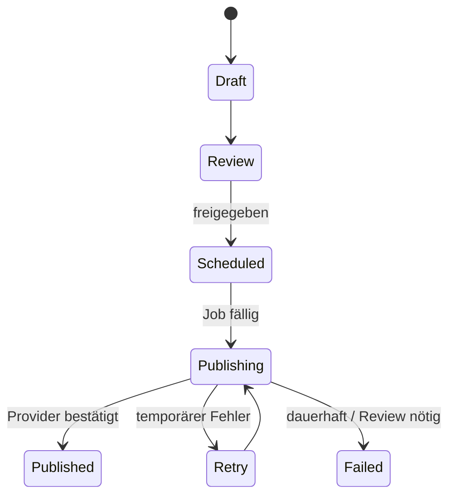

# ContentDock Architektur

## Zugriff und Abonnement

- `/demo` ist öffentlich und schreibgeschützt.
- `/dashboard` prüft die Abo-Berechtigung in einer Server Component vor dem Rendern.
- Mutierende Route Handler wie `/api/ai/caption` prüfen dieselbe Berechtigung erneut.
- Mollie-Redirects allein schalten nichts frei. `/api/mollie/confirm` lädt den autoritativen Zahlungsstatus und akzeptiert ausschließlich `paid`.
- Die HTTP-only-Berechtigung ist HMAC-signiert und auf 24 Stunden begrenzt. Für Produktion wird sie durch eine Datenbank-Session ersetzt, deren Subscription-Status über idempotente Webhooks aktualisiert wird.

## Zielbild

ContentDock trennt Produktoberfläche, Domänenlogik und Provider-Zugriffe. Die Web-App darf weiterentwickelt und getestet werden, auch wenn einzelne Plattform-Reviews noch ausstehen.

## Domänenmodule

| Modul | Verantwortung |
|---|---|
| Identity | Benutzer, Sessions, Workspaces und Rollen |
| Content | Assets, Entwürfe, Captions, Hashtags und Freigaben |
| Planning | Kalender, Zeitzone, Publication Jobs und Erinnerungen |
| Publishing | Provider-Capabilities, Upload, Status-Polling und Retries |
| Billing | Pläne, Mollie Customer/Payment/Subscription und Entitlements |
| Insights | Eigene Performance-Daten, Trend-Signale, Quellen und Testideen |
| Audience Review | Erklärbare Aktivitätssignale und manuelle Entscheidungen |
| Integrations | OAuth-Connections, verschlüsselte Tokens und Odoo-Sync |

## Veröffentlichungspfad

Jede Publication erhält einen idempotenten Schlüssel aus `content_item_id`, Provider und geplantem Zeitpunkt. Die Queue startet Provider-Aufrufe frühestens zur Zielzeit. Exponentielle Retries gelten nur für temporäre Fehler; Scope-, Policy- und Media-Fehler landen direkt im manuellen Review.

## Mandantenfähigkeit und Rechte

- Jede fachliche Tabelle trägt `workspace_id`.
- API-Zugriffe validieren Session, Workspace-Mitgliedschaft und Rolle.
- Rollen: `owner`, `admin`, `editor`, `reviewer`.
- Produktion: PostgreSQL Row Level Security zusätzlich zur Server-Autorisierung.
- Provider-Tokens werden envelope-verschlüsselt; der Schlüssel liegt nicht in der Datenbank.

## Medien

1. Client fordert eine signierte Upload-URL an.
2. Datei wird direkt in EU-basierten Objekt-Storage geladen.
3. Metadaten und Prüfsumme werden gespeichert.
4. Asynchron: Virenscan, Transcoding, Thumbnail und technische Validierung.
5. Nur geprüfte Assets dürfen Publication Jobs erzeugen.

Der lokale MVP verwendet ausschließlich eine Browser-Vorschau und persistiert keine hochgeladene Datei.

## BYOK-KI

Der aktuelle Route Handler akzeptiert einen OpenAI-Key im Header, verwendet ihn einmalig und speichert ihn nicht. Für Produktion gibt es zwei Optionen:

- **Ephemer:** Nutzer gibt den Key je Session/Anfrage an; maximale Datenminimierung.
- **Workspace-Key:** verschlüsselte Speicherung mit expliziter Zustimmung, Rotation, Audit-Log und einer „Jetzt löschen“-Funktion.

Prompts enthalten nur die für Caption/Hashtags erforderlichen Informationen. Medien werden nicht ungefragt an ein Modell übertragen.

## Mollie

1. User und gewählter Plan stehen serverseitig fest.
2. ContentDock erstellt einen Mollie Customer und speichert `customer_id`.
3. First Payment mit `sequenceType=first` autorisiert das Mandat.
4. Webhook liefert die Payment-ID; ContentDock lädt den Zustand direkt von Mollie.
5. Nach gültigem Mandat entsteht die monatliche Subscription.
6. Webhooks aktualisieren Subscription/Entitlements idempotent.

Der MVP implementiert Customer + First Payment und den autoritativen Payment-Fetch im Webhook. Datenbankpersistenz und Subscription-Erzeugung sind als Produktionsschritt markiert.

## Observability

- Strukturierte Logs ohne Tokens, API-Keys oder vollständige Provider-Payloads
- Korrelations-ID pro Publication und Webhook
- Metriken für Queue-Latenz, Provider-Fehlerquote und Publish-Erfolg
- Alarmierung bei Webhook-Fehlern, ablaufenden Tokens und blockierten Jobs
- Audit-Ereignisse für Freigabe, Veröffentlichung, Token-Wechsel und Audience-Review

## Deployment

- Vercel Preview pro Pull Request
- Produktions-Promotion erst nach Typecheck, Lint, Build und E2E-Kernflow
- Secrets getrennt nach Development, Preview und Production
- Datenbankmigration als expliziter, beobachtbarer Release-Schritt vor Promotion
