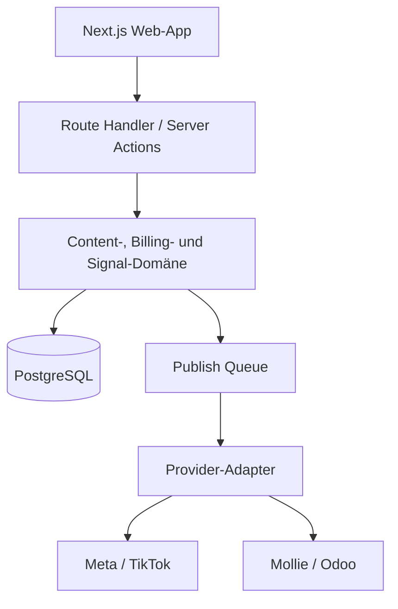
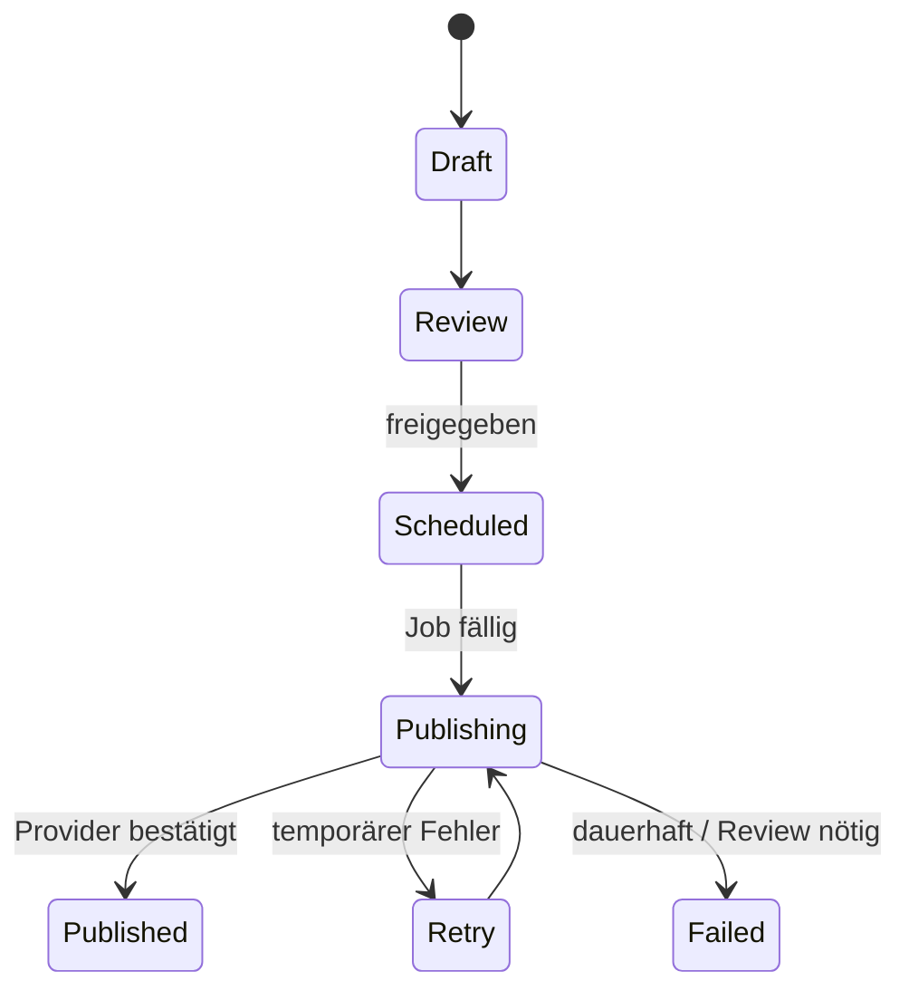

# ContentDock Architektur

## Zugriff und Abonnement

- `/demo` ist öffentlich und interaktiv; nur Publish-Aufrufe bleiben gesperrt.
- `/dashboard` prüft die Abo-Berechtigung in einer Server Component vor dem Rendern.
- Mutierende Route Handler wie `/api/ai/caption` und `/api/workspace/*` prüfen dieselbe Berechtigung erneut.
- Der Abo-Subject wird serverseitig einem stabilen `app_user`, `workspace` und `workspace_member` zugeordnet.
- Demo-Zustand bleibt cookiebasiert und wird niemals in Mandantentabellen geschrieben.
- Mollie-Redirects allein schalten nichts frei. `/api/mollie/confirm` lädt den autoritativen Zahlungsstatus und akzeptiert ausschließlich `paid`.
- Die HTTP-only-Berechtigung ist HMAC-signiert und auf 24 Stunden begrenzt. Für Produktion wird sie durch eine Datenbank-Session ersetzt, deren Subscription-Status über idempotente Webhooks aktualisiert wird.

## Zielbild

ContentDock trennt Produktoberfläche, Domänenlogik und Provider-Zugriffe. Die Web-App darf weiterentwickelt und getestet werden, auch wenn einzelne Plattform-Reviews noch ausstehen.

## Domänenmodule

| Modul | Verantwortung |
|---|---|
| Identity | Benutzer, Sessions, Workspaces und Rollen |
| Content | Assets, Entwürfe, Captions, Hashtags und Freigaben |
| Planning | Kalender, Zeitzone, Publication Jobs und Erinnerungen |
| Publishing | Provider-Capabilities, Upload, Status-Polling und Retries |
| Billing | Pläne, Mollie Customer/Payment/Subscription und Entitlements |
| Insights | Eigene Performance-Daten, Trend-Signale, Quellen und Testideen |
| Audience Review | Erklärbare Aktivitätssignale und manuelle Entscheidungen |
| Integrations | OAuth-Connections, verschlüsselte Tokens und Odoo-Sync |

## Social-OAuth

1. Der Start-Handler erzeugt einen HMAC-signierten, zehn Minuten gültigen `state`-Wert und bindet ihn an eine Demo- oder Abo-Session.
2. Ein providerbezogenes HTTP-only Cookie bindet den Wert an denselben Browser und verhindert Login-CSRF.
3. Meta, LinkedIn oder TikTok authentifiziert den Nutzer und leitet nur einen einmaligen Authorization Code zurück.
4. Der Callback prüft Flow-Modus, Session, Provider, Cookie und `state`, bevor der Code serverseitig gegen Tokens getauscht wird.
5. Der Demo-Modus verschlüsselt Tokens per AES-256-GCM in providerbezogenen HTTP-only Cookies.
6. Der Workspace-Modus schreibt denselben verschlüsselten Payload in `social_connection`; React erhält nur Accountname, Scopes und Ablaufdatum.

Die Live-Demo führt reale OAuth-Requests mit minimalen Identitäts-Scopes aus. Publishing-Scopes werden erst im abonnementgeschützten Workspace nachgefordert. Client Secrets und Provider-Tokens werden weder an Client Components serialisiert noch in Logs geschrieben.

## Veröffentlichungspfad

Jede Publication erhält einen idempotenten Schlüssel aus `content_item_id`, Provider und geplantem Zeitpunkt. Die Queue startet Provider-Aufrufe frühestens zur Zielzeit. Exponentielle Retries gelten nur für temporäre Fehler; Scope-, Policy- und Media-Fehler landen direkt im manuellen Review.

## Mandantenfähigkeit und Rechte

- Jede fachliche Tabelle trägt `workspace_id`.
- API-Zugriffe validieren Session, Workspace-Mitgliedschaft und Rolle.
- Rollen: `owner`, `admin`, `editor`, `reviewer`.
- Produktion: PostgreSQL Row Level Security zusätzlich zur Server-Autorisierung.
- Provider-Tokens werden envelope-verschlüsselt; der Schlüssel liegt nicht in der Datenbank.

## Medien

1. Die Demo erzeugt ausschließlich lokale Blob-Vorschauen.
2. Der angemeldete Test-Workspace sendet Dateien an einen authentifizierten Route Handler.
3. Dateityp, Anzahl und Größe werden begrenzt; Inhalt, Metadaten und SHA-256-Prüfsumme landen in `media_asset`.
4. Für größere Produktionsvideos wird die Binärablage später auf S3-kompatiblen Objekt-Storage verschoben; PostgreSQL behält Metadaten und Prüfsummen.
5. Vor echtem Publishing kommen Virenscan, Transcoding und technische Validierung hinzu.

Die aktuelle PostgreSQL-Binärablage ist bewusst auf Testdateien bis 12 MB begrenzt und kein Ersatz für skalierbaren Video-Objektspeicher.

## BYOK-KI

Der aktuelle Route Handler akzeptiert einen OpenAI-Key im Header, verwendet ihn einmalig und speichert ihn nicht. Für Produktion gibt es zwei Optionen:

- **Ephemer:** Nutzer gibt den Key je Session/Anfrage an; maximale Datenminimierung.
- **Workspace-Key:** verschlüsselte Speicherung mit expliziter Zustimmung, Rotation, Audit-Log und einer „Jetzt löschen“-Funktion.

Prompts enthalten nur die für Caption/Hashtags erforderlichen Informationen. Medien werden nicht ungefragt an ein Modell übertragen.

## Mollie

1. User und gewählter Plan stehen serverseitig fest.
2. ContentDock erstellt einen Mollie Customer und speichert `customer_id`.
3. First Payment mit `sequenceType=first` autorisiert das Mandat.
4. Webhook liefert die Payment-ID; ContentDock lädt den Zustand direkt von Mollie.
5. Nach gültigem Mandat entsteht die monatliche Subscription.
6. Webhooks aktualisieren Subscription/Entitlements idempotent.

Der MVP implementiert Customer + First Payment und den autoritativen Payment-Fetch im Webhook. Datenbankpersistenz und Subscription-Erzeugung sind als Produktionsschritt markiert.

## Observability

- Strukturierte Logs ohne Tokens, API-Keys oder vollständige Provider-Payloads
- Korrelations-ID pro Publication und Webhook
- Metriken für Queue-Latenz, Provider-Fehlerquote und Publish-Erfolg
- Alarmierung bei Webhook-Fehlern, ablaufenden Tokens und blockierten Jobs
- Audit-Ereignisse für Freigabe, Veröffentlichung, Token-Wechsel und Audience-Review

## Deployment

- Vercel Preview pro Pull Request
- Docker Compose mit Next.js-Standalone-App, PostgreSQL und vorgeschaltetem Migration-Service
- Produktions-Promotion erst nach Typecheck, Lint, Build und E2E-Kernflow
- Secrets getrennt nach Development, Preview und Production
- Datenbankmigrationen laufen versions- und prüfsummengesichert unter Advisory Lock vor dem App-Start
